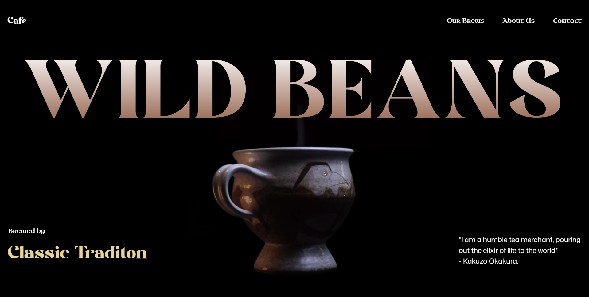
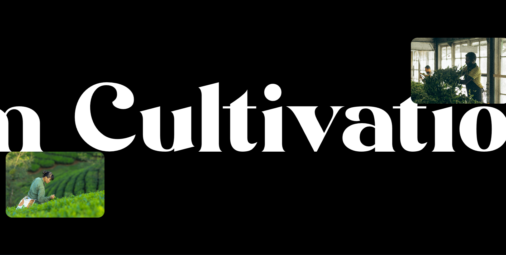

# ☕ Leo Wild Beans

A modern animated coffee shop landing page built with **React**, **GSAP ScrollTrigger**, and **TailwindCSS**.
This project focuses on smooth scroll-based storytelling, responsive UI design, and performance-friendly animations.

---

## 🚀 Live Demo

https://leo-wild-beans.vercel.app

---

## 🧰 Tech Stack


---

## 📸 Preview

Add screenshots inside `/public` folder:

```
public/preview1.png
public/preview2.png
```

Then they will display here:




---

## ✨ Features

* Scroll-triggered animations using GSAP
* Smooth section transitions
* Responsive landing page layout
* Modern UI with TailwindCSS
* Component-based React structure
* Optimized animation performance

---

## 📁 Project Structure

```
Leo_Wild_Beans
│
├── public
├── src
│   ├── components
│   ├── sections
│   └── App.jsx
│
├── index.html
├── package.json
└── vite.config.js
```

---

## ⚙️ Installation

Clone the repository:

```
git clone https://github.com/1826266272/Leo_Wild_Beans.git
```

Install dependencies:

```
npm install
```

Run the development server:

```
npm run dev
```

---

## 🧠 What I Learned

* Implementing scroll-based animation systems
* Coordinating GSAP with React lifecycle
* Building responsive layouts with TailwindCSS
* Structuring modern Vite + React projects
* Improving animation performance

---

## 👨‍💻 Author

**Sethu**
Engineering Student
Frontend Developer in progress 🚀
